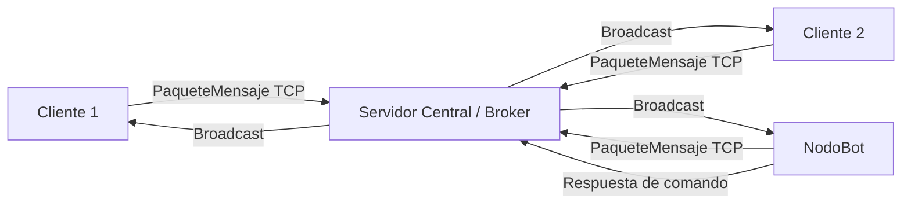
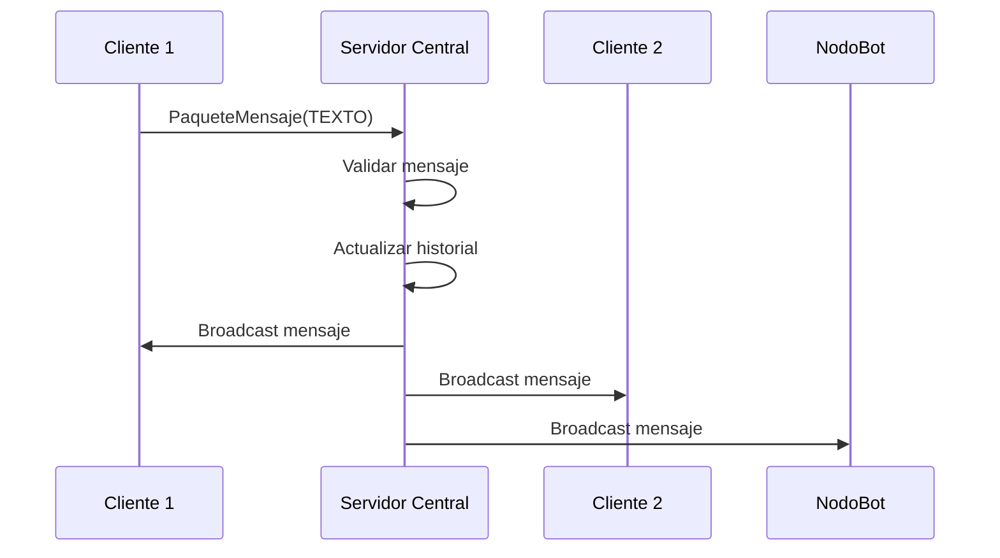
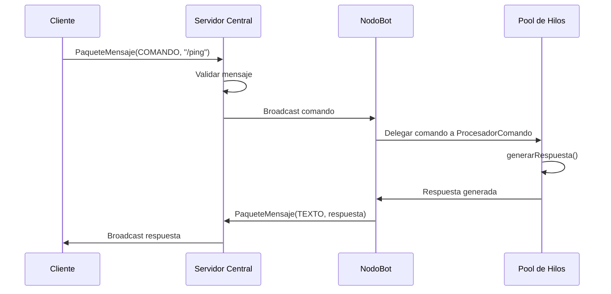
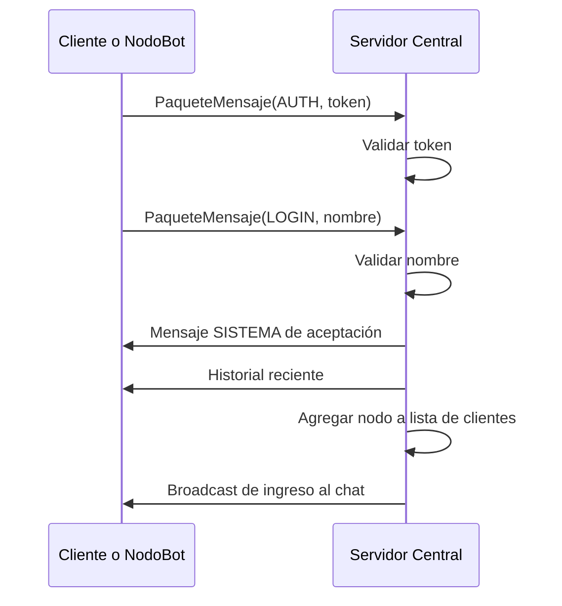

# Proyecto Parcial ICI-4344: Sistema Distribuido de Mensajería y Motor de Comandos

Este repositorio contiene la implementación de un sistema distribuido en Java inspirado en una plataforma de mensajería tipo Telegram. El sistema está construido bajo una arquitectura Cliente-Servidor con un servidor central tipo broker, múltiples clientes humanos y un nodo autónomo de bot encargado de procesar comandos.

El proyecto evidencia comunicación remota mediante Sockets TCP, marshalling de objetos complejos mediante serialización Java, concurrencia de usuarios/procesos, manejo de fallos independientes, transparencia de acceso y transparencia de ubicación mediante configuración de host y puerto.

---

## 1. Dominio del Sistema

El dominio seleccionado es un sistema distribuido de mensajería instantánea con soporte para comandos automatizados. El sistema permite que varios usuarios se conecten simultáneamente a un servidor central, envíen mensajes en tiempo real y utilicen un bot autónomo para ejecutar comandos.

La elección de este dominio justifica la distribución porque intervienen distintos procesos independientes:

1. Un servidor central encargado del enrutamiento de mensajes.
2. Múltiples clientes humanos conectados desde terminales diferentes.
3. Un nodo bot autónomo que procesa comandos de forma concurrente.

---

## 2. Funciones Principales del Sistema

### 2.1. Función 1: Mensajería distribuida en tiempo real

Los clientes humanos pueden enviar mensajes al servidor central. El servidor recibe cada mensaje, lo valida, lo almacena temporalmente en un historial reciente y luego lo difunde a todos los nodos conectados.

**Flujo general:**

```text
Cliente → Servidor Central → Clientes conectados / NodoBot
```

Esta función evidencia:

* Comunicación remota mediante Sockets TCP.
* Marshalling de objetos `PaqueteMensaje`.
* Concurrencia de múltiples usuarios.
* Sincronización sobre recursos compartidos.
* Manejo de desconexiones de clientes.

### 2.2. Función 2: Procesamiento distribuido de comandos mediante NodoBot

Los usuarios pueden enviar comandos como `/ping`, `/hora`, `/pesado`, `/ayuda` y `/aprender`. El servidor difunde estos comandos a la red, el `NodoBot` los detecta, los procesa en un pool de hilos y envía una respuesta al servidor para que sea difundida a todos los clientes.

**Flujo general:**

```text
Cliente → Servidor Central → NodoBot → Servidor Central → Clientes conectados
```

Esta función evidencia:

* Separación de responsabilidades entre servidor y bot.
* Procesamiento concurrente mediante `ExecutorService`.
* Aislamiento de fallos, ya que el bot puede caer sin detener el chat.
* Memoria dinámica segura mediante `ConcurrentHashMap`.

---

## 3. Arquitectura del Sistema

El ecosistema está compuesto por cinco clases principales:

1. **`Config.java`**

   * Centraliza constantes globales del sistema.
   * Define el token de autenticación, puerto por defecto, tamaño máximo del historial y tamaño máximo de mensaje.

2. **`PaqueteMensaje.java`**

   * Define el objeto serializable usado como unidad estándar de comunicación.
   * Contiene remitente, contenido, fecha local de envío y tipo de mensaje.
   * Implementa `Serializable`, permitiendo marshalling y unmarshalling entre procesos.

3. **`App.java`**

   * Servidor central del sistema.
   * Acepta conexiones TCP.
   * Autentica clientes mediante paquetes `AUTH` y `LOGIN`.
   * Crea un hilo por cliente conectado.
   * Mantiene lista de clientes activos.
   * Difunde mensajes.
   * Administra historial reciente.
   * Procesa comandos propios del servidor como `/usuarios` y `/historial`.

4. **`Cliente.java`**

   * Nodo humano del sistema.
   * Se conecta al servidor usando host y puerto configurables.
   * Envía autenticación y login.
   * Permite al usuario escribir mensajes y comandos.
   * Usa un hilo separado para el envío mientras el hilo principal escucha mensajes entrantes.

5. **`NodoBot.java`**

   * Nodo autónomo del sistema.
   * Se conecta al servidor como un cliente especializado.
   * Procesa comandos recibidos desde la red.
   * Usa un pool de 10 hilos para procesar múltiples comandos en paralelo.
   * Puede aprender comandos dinámicos mediante `/aprender`.

---

## 4. Modelo Arquitectónico



El servidor actúa como broker central. Los clientes y el bot no se comunican directamente entre sí, sino que intercambian objetos `PaqueteMensaje` a través del servidor.

---

## 5. Modelo Físico

El sistema puede ejecutarse de dos formas:

### 5.1. Simulación local

Todos los procesos se ejecutan en el mismo equipo, usando `localhost` como dirección del servidor.

```text
PC local
├── Proceso 1: Servidor App
├── Proceso 2: NodoBot
├── Proceso 3: Cliente 1
└── Proceso 4: Cliente 2
```

### 5.2. Ejecución en red LAN

El servidor se ejecuta en una máquina de la red y los clientes/bot se conectan usando la IP del servidor.

```text
Cliente 1 ─┐
Cliente 2 ─┼── Red LAN ── Servidor App
NodoBot  ──┘
```

Ejemplo:

```bash
java -cp app/build/classes/java/main org.example.Cliente 192.168.1.20 5000
java -cp app/build/classes/java/main org.example.NodoBot 192.168.1.20 5000
```

---

## 6. Protocolo de Comunicación

La comunicación entre nodos se realiza mediante objetos de la clase `PaqueteMensaje`.

### 6.1. Tipos de mensaje

```java
public enum Tipo {
    TEXTO,
    COMANDO,
    AUTH,
    LOGIN,
    SISTEMA
}
```

| Tipo      | Uso                                                                       |
| --------- | ------------------------------------------------------------------------- |
| `TEXTO`   | Mensaje normal enviado por un usuario o por el bot.                       |
| `COMANDO` | Mensaje que comienza con `/` y puede ser procesado por el bot o servidor. |
| `AUTH`    | Paquete inicial usado para enviar el token de autenticación.              |
| `LOGIN`   | Paquete usado para registrar el nombre del nodo conectado.                |
| `SISTEMA` | Mensajes informativos generados por el servidor.                          |

### 6.2. Marshalling y serialización

`PaqueteMensaje` implementa `Serializable`, lo que permite que la JVM convierta el objeto en una secuencia de bytes para transmitirlo por la red mediante `ObjectOutputStream`. En el nodo receptor, el objeto se reconstruye mediante `ObjectInputStream`.

Esto evita enviar texto plano sin estructura y permite transportar datos complejos como:

* Remitente.
* Contenido.
* Tipo de mensaje.
* Fecha local de envío.

---

## 7. Concurrencia

### 7.1. Concurrencia en el servidor

El servidor crea un hilo por cada cliente conectado:

```java
Thread hilo = new Thread(new ManejadorCliente(socket, out));
hilo.start();
```

Cada instancia de `ManejadorCliente` atiende de forma independiente los mensajes de un nodo específico.

### 7.2. Recursos compartidos protegidos

El servidor utiliza recursos compartidos que deben protegerse:

* Lista de clientes conectados.
* Historial reciente de mensajes.
* Flujos de salida hacia cada cliente.

Para evitar condiciones de carrera se utilizan bloques `synchronized`.

### 7.3. Concurrencia en el bot

El `NodoBot` utiliza un pool de hilos:

```java
Executors.newFixedThreadPool(10);
```

Esto permite que comandos pesados como `/pesado` no bloqueen el procesamiento de otros comandos. Por ejemplo, mientras un usuario ejecuta `/pesado`, otro usuario puede ejecutar `/ping` y recibir una respuesta inmediata.

---

## 8. Transparencia

### 8.1. Transparencia de acceso

Los clientes no necesitan saber si un mensaje será procesado por otro usuario, por el servidor o por el bot. Todos los nodos usan el mismo objeto `PaqueteMensaje` y el mismo canal de comunicación TCP.

Ejemplo:

```text
/ping
```

El usuario solo escribe el comando. El sistema se encarga de difundirlo y el bot lo procesa automáticamente.

### 8.2. Transparencia de ubicación

El cliente y el bot pueden recibir el host y puerto del servidor como argumentos de ejecución.

```bash
java -cp app/build/classes/java/main org.example.Cliente localhost 5000
java -cp app/build/classes/java/main org.example.Cliente 192.168.1.20 5000
```

Esto permite cambiar la ubicación del servidor sin modificar el código fuente.

---

## 9. Modelo de Seguridad

El sistema implementa medidas básicas de seguridad orientadas a la primera entrega del proyecto.

| Amenaza                          | Descripción                                                 | Mitigación implementada o propuesta                                             |
| -------------------------------- | ----------------------------------------------------------- | ------------------------------------------------------------------------------- |
| Conexión no autorizada           | Un nodo externo intenta entrar al sistema.                  | Token inicial mediante paquete `AUTH`.                                          |
| Nombre de usuario inválido       | Un cliente intenta usar un nombre vacío o problemático.     | Validación con expresión regular `[a-zA-Z0-9_]{3,20}`.                          |
| Mensajes excesivamente largos    | Un cliente intenta saturar el sistema con mensajes grandes. | Límite de `MAX_MENSAJE = 300`.                                                  |
| Comandos reservados sobrescritos | Un usuario intenta redefinir `/ping`, `/hora`, etc.         | El bot bloquea comandos reservados en `/aprender`.                              |
| Intercepción de tráfico          | TCP sin cifrado puede ser observado en una red insegura.    | Mejora futura: uso de `SSLSocket` y `SSLServerSocket`.                          |
| Riesgo por deserialización       | `ObjectInputStream` puede recibir objetos no esperados.     | Validación con `instanceof PaqueteMensaje`; mejora futura: `ObjectInputFilter`. |

Importante: el token implementado es una autenticación básica para fines académicos. No reemplaza un sistema de autenticación seguro en producción.

---

## 10. Modelo de Fallos

| Tipo de fallo    | Nodo afectado | Ejemplo                                         | Detección                                      | Recuperación                                                             |
| ---------------- | ------------- | ----------------------------------------------- | ---------------------------------------------- | ------------------------------------------------------------------------ |
| Crash            | Cliente       | El usuario cierra la terminal.                  | `IOException` en `ManejadorCliente`.           | El servidor elimina el cliente de la lista y mantiene el sistema activo. |
| Crash            | NodoBot       | Se cierra el proceso del bot.                   | El servidor detecta la pérdida de conexión.    | El chat sigue funcionando sin comandos del bot.                          |
| Omisión          | Cliente o bot | Fallo al enviar un mensaje.                     | Excepción en `writeObject()` o `readObject()`. | Se descarta el envío fallido y se mantiene el servidor operativo.        |
| Entrada inválida | Cliente       | Mensaje vacío, nombre inválido o mensaje largo. | Validaciones en servidor y cliente.            | El sistema rechaza la entrada sin detenerse.                             |
| Crash            | Servidor      | Se detiene `App.java`.                          | Clientes y bot pierden conexión.               | Mejora futura: reconexión automática y servidor de respaldo.             |

---

## 11. Ausencia de Reloj Global

Cada `PaqueteMensaje` contiene una marca temporal local mediante `LocalDateTime.now()`. Esta marca se usa para mostrar la hora del mensaje en consola.

Sin embargo, esta fecha no representa un reloj lógico distribuido ni garantiza un orden global absoluto entre máquinas distintas. En esta implementación, el orden práctico de difusión es definido por el servidor central según el orden en que recibe los mensajes.

Una mejora futura sería incorporar un número de secuencia asignado por el servidor o implementar relojes lógicos de Lamport.

---

## 12. Comandos Disponibles

### 12.1. Comandos del servidor

| Comando      | Descripción                                |
| ------------ | ------------------------------------------ |
| `/usuarios`  | Muestra los usuarios conectados.           |
| `/historial` | Muestra el historial reciente de mensajes. |

### 12.2. Comandos del bot

| Comando                        | Descripción                                                    |
| ------------------------------ | -------------------------------------------------------------- |
| `/ping`                        | Responde rápidamente indicando el hilo que procesó el comando. |
| `/hora`                        | Muestra la hora local del nodo bot.                            |
| `/pesado`                      | Simula una tarea pesada de 5 segundos.                         |
| `/ayuda`                       | Muestra los comandos disponibles.                              |
| `/aprender /comando respuesta` | Permite enseñar un nuevo comando dinámico al bot.              |

### 12.3. Comando local del cliente

| Comando  | Descripción                   |
| -------- | ----------------------------- |
| `/salir` | Cierra el cliente localmente. |

---

## 13. Instrucciones de Ejecución

### 13.1. Compilar el proyecto

```bash
./gradlew classes
```

En PowerShell de Windows también puede ejecutarse como:

```powershell
./gradlew classes
```

### 13.2. Levantar el servidor

Terminal 1:

```bash
./gradlew run
```

Alternativamente:

```bash
java -cp app/build/classes/java/main org.example.App
```

Para especificar otro puerto:

```bash
java -cp app/build/classes/java/main org.example.App 5001
```

### 13.3. Levantar el NodoBot

Terminal 2:

```bash
java -cp app/build/classes/java/main org.example.NodoBot
```

Con host y puerto explícitos:

```bash
java -cp app/build/classes/java/main org.example.NodoBot localhost 5000
```

### 13.4. Levantar clientes

Terminal 3:

```bash
java -cp app/build/classes/java/main org.example.Cliente
```

Terminal 4:

```bash
java -cp app/build/classes/java/main org.example.Cliente
```

Con host y puerto explícitos:

```bash
java -cp app/build/classes/java/main org.example.Cliente localhost 5000
```

---

## 14. Guía de Pruebas para Demo

Para demostrar el sistema, se recomienda abrir cuatro terminales:

1. Servidor.
2. NodoBot.
3. Cliente 1.
4. Cliente 2.

### 14.1. Prueba de mensajería

Desde Cliente 1:

```text
Hola desde Cliente 1
```

Desde Cliente 2:

```text
Hola desde Cliente 2
```

Ambos mensajes deben visualizarse en todos los clientes conectados.

### 14.2. Prueba de usuarios conectados

```text
/usuarios
```

El servidor debe responder con la lista de usuarios activos.

### 14.3. Prueba de historial

```text
/historial
```

El servidor debe enviar los últimos mensajes almacenados.

### 14.4. Prueba de comandos del bot

```text
/ping
/hora
/ayuda
```

El bot debe responder a cada comando.

### 14.5. Prueba de concurrencia del bot

Desde Cliente 1:

```text
/pesado
```

Mientras el comando pesado está ejecutándose, desde Cliente 2:

```text
/ping
```

El sistema debe mostrar que `/ping` puede responder sin esperar necesariamente a que finalice `/pesado`, demostrando procesamiento concurrente en el bot.

### 14.6. Prueba de aprendizaje dinámico

Desde cualquier cliente:

```text
/aprender /saludo Hola a todos desde el bot
```

Luego:

```text
/saludo
```

El bot debe responder con el mensaje aprendido.

### 14.7. Prueba de resiliencia ante fallos

1. Cerrar forzosamente un cliente.
2. Verificar que el servidor detecta la desconexión.
3. Confirmar que los demás clientes siguen funcionando.
4. Cerrar el bot.
5. Verificar que el chat sigue funcionando, aunque los comandos del bot ya no respondan.

---

## 15. Diagramas de Secuencia

### 15.1. Envío de mensaje normal



### 15.2. Procesamiento de comando por bot



### 15.3. Autenticación de un nodo



---

## 16. Limitaciones y Mejoras Futuras

Aunque el sistema cumple los objetivos principales de la primera entrega, existen mejoras posibles:

1. Implementar cifrado con `SSLSocket` y `SSLServerSocket`.
2. Agregar reconexión automática para clientes y bot.
3. Incorporar un número de secuencia global asignado por el servidor.
4. Usar un `ThreadPoolExecutor` con cola limitada en el bot para evitar saturación.
5. Separar la lógica del servidor en servicios independientes para mejorar mantenibilidad.
6. Reemplazar `ObjectInputStream` por un protocolo más seguro como JSON con validación explícita.
7. Agregar persistencia del historial en archivo o base de datos.
8. Implementar un servidor secundario o mecanismo de respaldo.

---

## 17. Resumen Técnico

El proyecto implementa un sistema distribuido en Java compuesto por procesos independientes que colaboran mediante Sockets TCP. La comunicación se realiza mediante objetos serializados `PaqueteMensaje`, lo que permite marshalling de estructuras complejas. El servidor central atiende múltiples nodos concurrentemente usando un hilo por conexión, protege recursos compartidos mediante sincronización y maneja fallos parciales de clientes. El `NodoBot` opera como un proceso independiente con pool de hilos y memoria concurrente, permitiendo ejecutar comandos sin bloquear el sistema completo.

En conjunto, el proyecto evidencia los conceptos de concurrencia, comunicación distribuida, manejo de fallos independientes, transparencia de acceso, transparencia de ubicación, seguridad básica y separación de responsabilidades.
